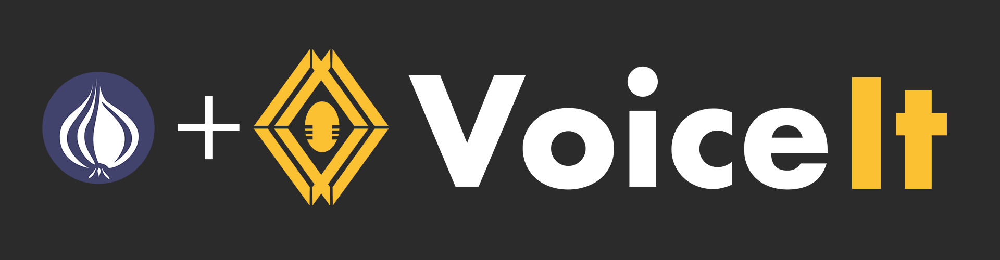

# VoiceIt3-Perl   

A Perl wrapper for VoiceIt's API 3.0 featuring Voice + Face Verification and Identification.

## Getting Started

Sign up for a free Developer Account at [VoiceIt.io](https://voiceit.io/signup). Visit the settings tab to view your API Key and Token. 

## API calls
You can visit our [HTTP API 3.0 Documentation](https://api.voiceit.io/?perl#introduction) for detailed information on each API call.

## Support

Contact us with any questions at support@voiceit.io

## License

VoiceIt3-Perl is available under the MIT license. See the LICENSE file for more info.

